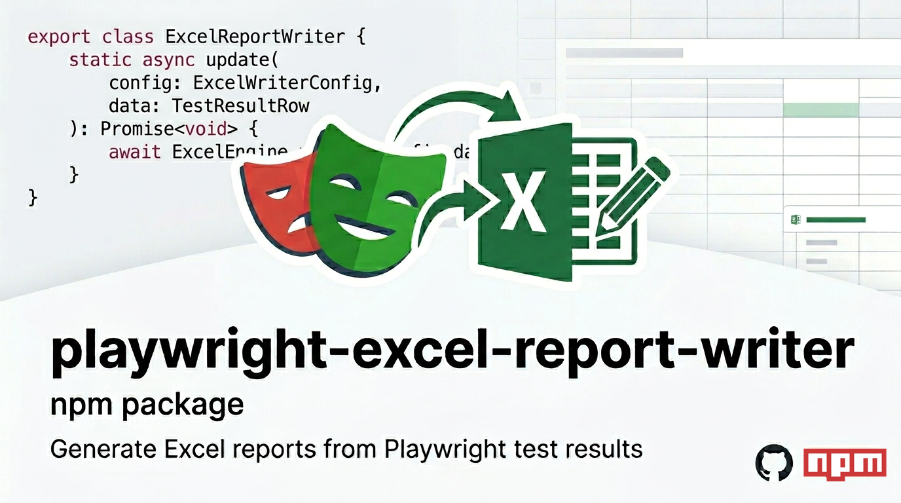

<p align="left">
  
</p>

# playwright-excel-report-writer

This low-level Excel reporting engine for Playwright and test automation frameworks solves a long-standing ExcelJS limitation: **rows containing images cannot be safely deleted or replaced**.

The engine rebuilds worksheets safely while preserving screenshots and supports **parallel Playwright execution** via file locking.

## Installation

```bash
npm install playwright-excel-report-writer exceljs
```

## Recommended Usage Pattern

`playwright-excel-report-writer` is intended to be used via a **thin wrapper**
inside your Playwright framework.

This wrapper:
- Defines the Excel file location
- Defines report columns and styling
- Exposes a simple API to tests and hooks

All ExcelJS logic and file-handling complexity is managed internally by the package.

## Example

Create a helper file in your Playwright project.

```ts
import { ExcelReportWriter, type ExcelWriterConfig, type TestResultRow } from 'playwright-excel-report-writer';

export class ExcelWriter {
  private static readonly config: ExcelWriterConfig = {
    file: {
      // Folder & file names to save the report
      directory: 'test-results',
      fileName: 'excel-report.xlsx'
    },

    sheet: {
      strategy: 'by-browser',
      // Test Results - Edge || Test Results - Chrome || Test Results - Firefox (sheet names) as per your test run
      namePattern: 'Test Results - {browser}'
    },

    rowKey: 'testCase',

    columns: [
      { key: 'testCase', header: 'Test Case', width: 60 },
      { key: 'result', header: 'Result', width: 12 },
      { key: 'reason', header: 'Failure Reason', width: 60 },
      { key: 'output', header: 'Test Output', width: 55 },
      { key: 'time', header: 'Execution Time', width: 18 },
      // This package is more useful when you need to manage screenshots
      { key: 'screenshot', header: 'Screenshot', width: 60, type: 'image' },
      { key: 'otherDetails', header: 'Other Details', width: 35 }
    ],

    image: {
      columnKey: 'screenshot',
      showOnlyOnFail: true,
      width: 425,
      height: 260
    },

    styles: {
      headerBold: true,
      passFill: 'FF00C853', // GREEN for Pass
      failFill: 'FFD50000' // RED for Fail
    },

    lockTimeoutMs: 30000
  };

  // Public API used by Playwright tests and hooks.
  static async updateResults(
    data: TestResultRow
  ): Promise<void> {
    await ExcelReportWriter.update(this.config, data);
  }
}
```

## Using the writer in tests or hooks
Call the wrapper from your Playwright hooks _(if using any BDD framework)_ or test lifecycle code.


```ts
await ExcelWriter.updateResults({
  testCase: rawScenarioName,
  browser,
  result: status,
  reason: formattedReason,
  output,
  time: `${(testInfo.duration / 1000).toFixed(2)} sec`,
  screenshot: screenshotPath,
  otherDetails
});
```


## Module format

This package is published as **ESM-only**.

✅ Works with:
- Playwright
- TypeScript
- Node.js 18+

❌ Not supported:
- `require()` (CommonJS)

If you need CommonJS support, please open an issue.

## Author
### [Praveen Prasannan](https://github.com/praveenprasannan)
